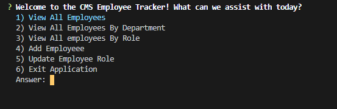
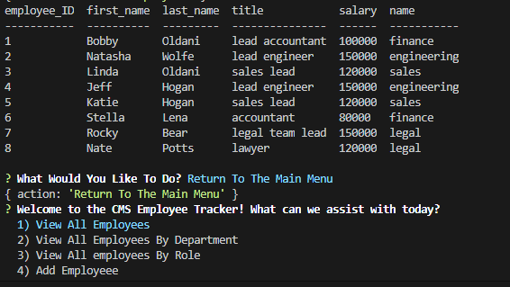

# CMS-Employee-Tracker

## General 

A CLI Content Management System application that allows the user to view and update employee, role, and department data. This application uses MySQL database with three tables to gather data for the employee, roles, and departments.





To use, simply clone this repo to your local machine.

Install dependencies
```node.js
npm install
```

Run the application
```node.js
node cms.js
```
## User story

As a business owner I want to be able to view and manage the departments, roles, and employees in my company so that I can organize and plan my business

## Technologies used
 
 * HTML/CSS
 * JavaScript
 * NodeJS
 * MySQL
 
 ## Dependencies
 
 * console.table 0.10.0
 * express 4.17.1
 * inquirer 7.0.5
 * mysql 2.18.1

### What I learned

I had some challanges with this application. MySQL queries can get very complex quickly. It can be much more effient to write functions to call queries. In the end, I had a much better understanding of MySQL queries and table joins.


